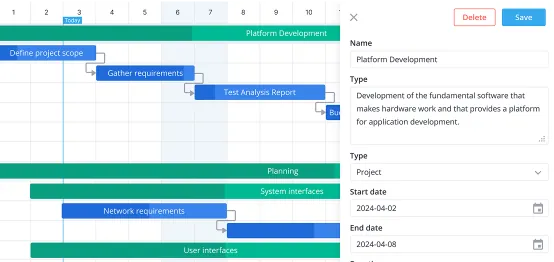

# Simple Web Gantt Editor

Many project teams use excel to create Gantt style plans, while it works there are some downsides.
This app provides user with the ability to load an app into your browser, that enables the development and display of gantt project plans with all data still residing locally in your browser. **No data gets sent back to a server.** You can save and load Gantt data to your local file system as when you close your browser the data disappears!



There are many debates an opinion on the use of Gantt charts, especially if when the team is using Agile approaches to delivery.
In my experience there are often senior stakeholders who desire/like Gantt charts. With good stakeholder training and expectation management you can use Gantt charts in an environment where Agile approaches are also used.  Especially if you also use Critical Chain Project Management techniques in which you provide buffers to deal with uncertainty.

This app is a modern, feature-rich Gantt chart utility which would not be possible without [Svelte](https://svelte.dev/) and [SVAR components.](https://svar.dev/svelte/gantt/)

Svelte is a UI framework that uses a compiler to let you write concise components using HTML, CSS and JavaScript. Developers consistently rank Svelte as the framework they’re most excited about using.

This application provides a comprehensive project management interface for manually scheduling tasks, resource assignments, linking dependencies, and managing project markers and file import/export capabilities.

When you have your plan make sure to save it to your local drive. Then maximize the Gantt chart and take a screen shot to include in your communications materials.

## 🚀 Features

### Core Functionality

- **Interactive Gantt Chart**: Visual timeline with tasks, dependencies, and progress tracking
- **Task Management**: Create, edit, delete, and organize hierarchical tasks
- **Link Dependencies**: Visual link creation between tasks with different relationship types
- **Project Markers**: Timeline markers for important milestones and deadlines
- **Progress Tracking**: Visual progress bars and percentage completion
- **Multiple Task Types**: Support for tasks, summary tasks, critical tasks, milestones, buffers and more

### User Interface

- **Custom Toolbar**: Save, load, new project, and marker management buttons
- **Task Editor**: Comprehensive form with two-column layout for task details
- **Comments System**: Built-in commenting system for task collaboration
- **Custom Tooltips**: Rich hover information for tasks and timeline elements

### Data Management

#### ID Normalization Toggle

- Toggle: "Normalize IDs on save" (in the top toolbar)
- When ON (default): Task IDs and link endpoints are remapped to a clean numeric sequence (1..N) in the saved file for readability and testing.
- When OFF: If any tasks have temporary IDs like `temp://123456789`, saved tasks and links will retain those IDs unmodified. This is useful during editing sessions to avoid breaking in-memory relations.
- The save metadata includes `normalizedIds: true|false` so you can tell which mode produced the file.

#### Timeline Viewport Persistence

- The current timeline Start and End values are saved into metadata (`timelineStart`, `timelineEnd`).
- When loading a file, the timeline is restored from metadata if present. If not present, the app computes a sensible window from the tasks’ min start and max end (with padding) to ensure the project is visible immediately.

- **File Import/Export**: Save and load projects as JSON files
- **Data Persistence**: Maintains state across browser sessions
- **Real-time Updates**: Immediate visual feedback for all changes
- **Undo/Redo**: Built-in operation history (via SVAR Gantt)

### Advanced Features

- **Multi-level Zoom**: From years to hours view with intelligent scaling
- **Weekend Highlighting**: Visual distinction for non-working days
- **Resource Management**: Assign and track resources across tasks
- **URL Links**: Attach external links to tasks
- **Custom Styling**: Configurable themes and visual styles

## 📦 Installation

### Prerequisites
- Node.js 16+
- npm or yarn

### Quick Start

1. **Clone the repository**
   ```bash
   git clone <repository-url>
   cd simple-web-gantt-viewer
   ```

2. **Install dependencies**
   ```bash
   npm install
   ```

3. **Start development server**
   ```bash
   npm run dev
   ```

4. **Open browser**
   Navigate to `http://localhost:5173` (or the URL shown in terminal)

### Build for Production

```bash
npm run build
```

The built files will be in the `dist/` directory, ready for deployment.

### Deploy to cloudflare worker website for access via public browser

After building the assets, above with no errors you can check the wrangler.toml

```toml
#:schema node_modules/wrangler/config-schema.json
name = "simple-web-gantt-editor"
compatibility_date = "2024-09-25"
assets = { directory = "./dist" }
```

Install cloudfare wrangler CLI utility

```bash
npx wrangler --version
```

Login to your account
```bash
npx wrangler login
```

Deploy app to cloud site
```bash
npm run deploy
```

Deployment console output

```bash
 ⛅️ wrangler 4.31.0
───────────────────
🌀 Building list of assets...
✨ Read 4 files from the assets directory C:\Users\rnwol\workspace\simple-web-gantt-viewer\dist
🌀 Starting asset upload...
🌀 Found 3 new or modified static assets to upload. Proceeding with upload...
+ /index.html
+ /assets/index-9PkJZyyr.css
+ /assets/index-JpO8yJsk.js
Uploaded 1 of 3 assets
Uploaded 2 of 3 assets
Uploaded 3 of 3 assets
✨ Success! Uploaded 3 files (2.88 sec)

Total Upload: 0.36 KiB / gzip: 0.26 KiB
Uploaded simple-web-gantt-editor (12.28 sec)
Deployed simple-web-gantt-editor triggers (3.51 sec)
  https://simple-web-gantt-editor.throughputfocus.workers.dev
Current Version ID: 97161d48-2900-4d58-8492-f029746a4a08
```

If you want to make this app accessable via a simple URL then set up a CNAME DNS record.

to map https://gantt.rnwolf.net to https://simple-web-gantt-editor.throughputfocus.workers.dev

Then add route to cloudflare so that you run your Worker for a given url.

```
Route: gantt.rnwolf.net/*
Worker: simple-web-gantt-editor
```


## 🎯 Usage

### Getting Started

1. **Load Sample Data**: The application starts with sample project data
2. **Explore the Interface**:
   - Left panel shows the task list with names, dates, and progress
   - Right panel shows the timeline with Gantt bars and dependencies
   - Top toolbar contains action buttons

### Basic Operations

#### Creating Tasks

1. Double-click in the task list area or timeline
2. Fill in the task details in the popup editor:
   - **Task Name**: Descriptive name for the task
   - **Description**: Detailed task information
   - **Start Date & Duration**: Timeline positioning
   - **Progress**: Completion percentage
   - **Task Type**: Task, Summary, Milestone, etc.
   - **Resources**: Assigned team members or resources

#### Creating Links/Dependencies

1. **Create links**: Hover over a task and click on the circular link handle then move to the destination task in click on the circular link handle thus create a link.
2. **Modify links with task editor**: Use the "Links" section in the task editor
   - Delete links
   - Modify link type
3. **Link Types**:
   - **End-to-Start** (E2S): Second task starts when first ends
   - **Start-to-Start** (S2S): Tasks start together
   - **End-to-End** (E2E): Tasks end together
   - **Start-to-End** (S2E): Second task ends when first starts

#### Managing Project Markers

1. Click the **"Markers"** button in the toolbar
2. In the marker manager:
   - **View existing markers**: Start Project, Today, End Project
   - **Add new markers**: Click "Add Marker" and fill in details
   - **Edit markers**: Click "Edit" button on any marker
   - **Delete markers**: Click "Delete" button (with confirmation)

### File Operations

#### Excel Import/Export helper (Python)

A helper script is provided to convert between the JSON project format and an Excel workbook.

Prerequisites: Astral’s uv (no virtualenv needed). The script declares its dependencies inline.

- Export JSON -> Excel
  ```bash
  uv run scripts/gantt_excel_helper.py to-xlsx --in docs/gantt-project-2025-08-22.json --out out.xlsx
  ```

- Import Excel -> JSON
  ```bash
  uv run scripts/gantt_excel_helper.py to-json --in out.xlsx --out out.json --project-name "My Plan"
  ```

- Optional: Override timeline window when importing
  ```bash
  uv run scripts/gantt_excel_helper.py to-json --in out.xlsx --out out.json \
    --timeline-start 2025-08-10T00:00:00Z --timeline-end 2025-09-30T00:00:00Z
  ```

Notes:
- The Excel file uses two sheets: Tasks and Links (Tasks required; Links optional).
- Dates may be Excel dates or ISO strings; they will be converted to ISO 8601 Z times in JSON.
- The import generates metadata (including timeline), and includes default arrays for `scales`, `columns`, and `taskTypes` so the file loads in the editor out-of-the-box.

#### Saving Projects

1. Click **"Save"** in the toolbar
2. Choose location and filename
3. File saves as JSON with all project data

#### Loading Projects

1. Click **"Load"** in the toolbar
2. Select a previously saved JSON file
3. Project data replaces current content

#### Starting Fresh

1. Click **"New"** in the toolbar
2. Confirm to clear all current data
3. Starts with a clean project template

### Advanced Usage

#### Task Hierarchy

- Create **parent-child relationships** by setting the parent field
- **Summary tasks** automatically calculate dates from children
- **Expand/collapse** hierarchical structures

#### Progress Tracking

- Set progress percentage (0-100%) for any task
- **Visual progress bars** show completion within Gantt bars
- **Summary task progress** calculated from children

#### Comments & Collaboration

- Add **comments** to any task using the Comments tab
- **User(Dummy, as there is no login to id users) attribution** with timestamps

#### Resource Assignment

- Assign **resources** (team members, equipment) to tasks
- **Resource codes** like "R001, R002" for tracking

#### Resource View (export)

- Export a resource-centric view of your plan via the toolbar button labeled "Resources".
- The exported JSON groups tasks by assigned resource under summary tasks labeled "Resource: {RESOURCE}".
- Child tasks are duplicated under each resource they belong to and use the type "progress" to emphasize tracking.
- Summary task dates (start/end/duration) are recalculated from their children in the export.
- Links are intentionally omitted from the resource export for clearer resource loading analysis.
- Important: Tasks without any resource assigned are excluded from the resource view export.

TIP: Save the Resource view, then open a second browser window/tab, load the resource view there, and align your Project Plan window and Resource View window side-by-side. This makes it easy to visually compare plan vs capacity by resource.

#### Custom Styling

- **CSS classes** for different marker types
- **Colour coding** for different task types
- **Weekend highlighting** and custom timeline styling

## 🛠 Technical Details

### Architecture

- **Frontend**: Svelte 5 with modern reactive patterns
- **Components**: SVAR Svelte component library
- **Build Tool**: Vite for fast development and optimized builds
- **Styling**: CSS with Willow theme integration

### Key Dependencies

- **wx-svelte-gantt**: Core Gantt chart functionality
- **wx-svelte-core**: UI components (DatePicker, Field, etc.)
- **wx-svelte-comments**: Commenting system
- **svelte**: Reactive UI framework

### Project Structure

```
src/
├── App.svelte                 # Main application component
├── MarkerManager.svelte       # Marker CRUD interface
├── SimpleCustomTaskForm.svelte # Task editing form
├── Links.svelte              # Link/dependency management
├── MyTooltipContent.svelte   # Custom tooltip display
├── urlCell.svelte           # URL link cell renderer
├── gantt-styles.css         # Custom Gantt styling
└── main.js                  # Application entry point
```

### Data Format

#### Task Structure

```javascript
{
  id: 1,                    // Unique identifier
  text: "Task Name",        // Display name
  start: Date,              // Start date
  duration: 5,              // Duration in days
  optimistic: 5,            // Optimistic duration in days
  pessimistic: 10,          // Pessimistic duration in days
  progress: 60,             // Completion percentage (0-100)
  type: "task",            // task, summary, milestone, etc.
  parent: null,            // Parent task ID for hierarchy
  resources: "R001, R002", // Assigned resources
  details: "Description", // Task description
  url: "https://...",     // External link
  comments: [...]         // Comment array
}
```

#### Link Structure
```javascript
{
  id: 1,           // Unique identifier
  source: 2,       // Source task ID
  target: 3,       // Target task ID
  type: "e2s"      // end-to-start, start-to-start, etc.
}
```

#### Marker Structure
```javascript
{
  id: 1,                    // Unique identifier
  start: Date,              // Marker date
  text: "Milestone Name",   // Display text
  css: "myMarkerClass"     // Optional CSS class for styling
}
```

## 🎨 Customization

### Styling

- Modify `src/gantt-styles.css` for visual customization
- **Task colours**: Update CSS for different task types
- **Timeline appearance**: Modify grid, headers, and weekend styling
- **Custom markers**: Add CSS classes for different marker types

### Configuration

- **Zoom levels**: Adjust in App.svelte `zoomConfig`
- **Task types**: Modify `taskTypes` array
- **Date formats**: Update `standardDateConfig`
- **User list**: Modify `users` array for comments

### Extensions

- **Custom validators**: Implement in form components
- **Export formats**: Extend file operations
- **Integration APIs**: Add external system connectivity

## ❓ FAQ

- Why can’t I see my project tasks after loading a file?
  - The visible timeline window (Timeline Start/End) may not overlap your project’s task dates. The app now saves `timelineStart`/`timelineEnd` in the project metadata and restores them on load. If your file lacks these, the app will auto-derive a window from task dates. You can also manually adjust "Timeline Start" and "Timeline End" in the top bar to bring tasks into view.

## 📋 Browser Compatibility

- **Modern browsers**: Chrome 90+, Firefox 88+, Safari 14+, Edge 90+
- **Mobile browsers**: iOS Safari 14+, Chrome Mobile 90+
- **JavaScript**: ES2020+ features required
- **Local file access**: Required for save/load functionality

## 🤝 Contributing

1. Fork the repository
2. Create a feature branch (`git checkout -b feature/amazing-feature`)
3. Commit your changes (`git commit -m 'Add amazing feature'`)
4. Push to the branch (`git push origin feature/amazing-feature`)
5. Open a Pull Request

## 📄 License

This project is licensed under the GNU General Public License v3.0 License - see the LICENSE file for details.

## 🙏 Acknowledgments

- **SVAR Team**: For the excellent Svelte component library
- **Svelte Team**: For the reactive UI framework
- **Vite Team**: For the lightning-fast build tool

---

**Built with ❤️ using Svelte and SVAR components**
